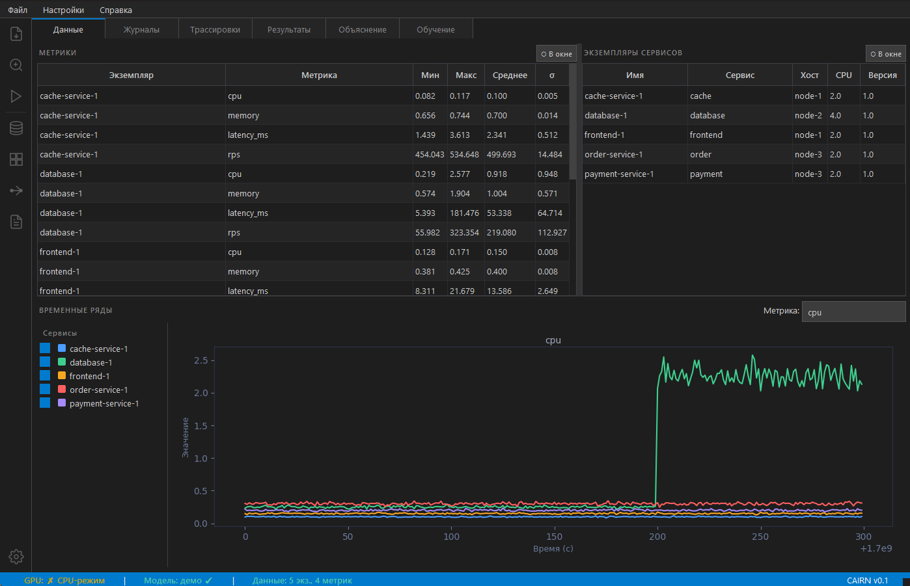
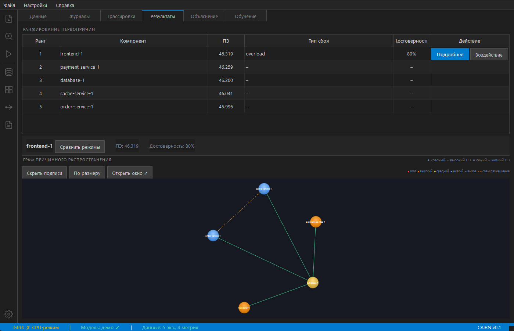
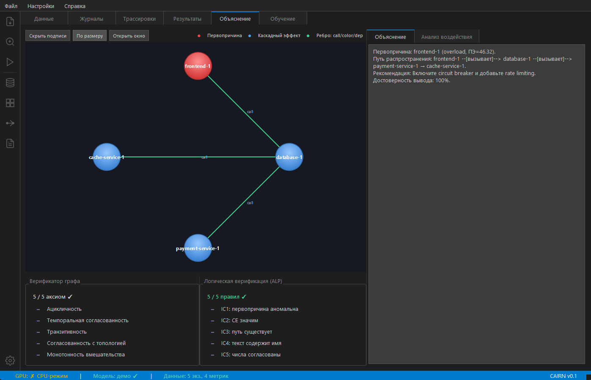
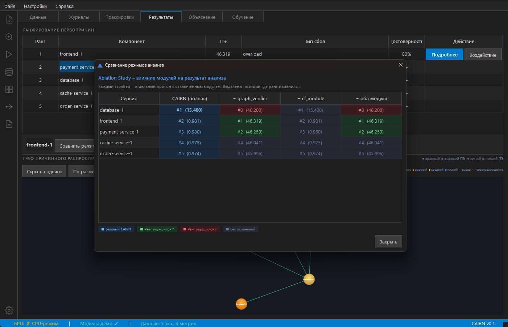
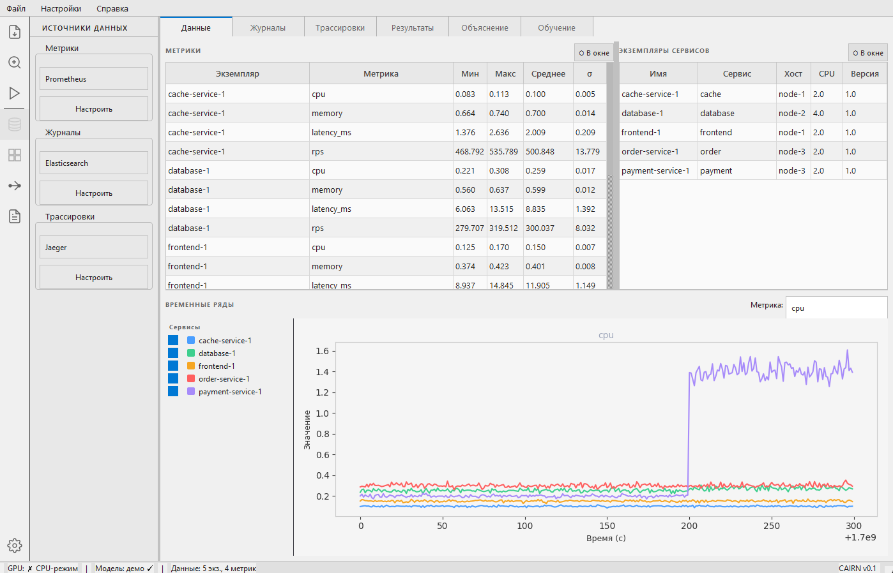

# CAIRN – Causal AI Root-cause Navigator

> Интеллектуальная система поиска первопричин сбоев в микросервисных приложениях на основе причинно-следственного вывода и интерпретируемых нейронных сетей.

Дипломная работа, СПбГУТ, 2026.

---

## Ключевые возможности

- **Автоматический анализ первопричин** – ранжирование микросервисов по вероятности быть источником сбоя
- **Причинно-следственный вывод** – гиперграфовая модель распространения отказов (CAIRN-GMM)
- **Мультимодальные данные** – метрики, логи и трассировки обрабатываются совместно
- **Граф причинного распространения** – интерактивная визуализация каскада отказов
- **Цепочка доказательств** – объяснение каждого вывода на естественном языке
- **Ablation Study** – сравнение режимов работы (с/без верификатора графа, CF-модуля)
- **Светлая и тёмная темы** – полностью настраиваемый интерфейс

---

## Скриншоты

| Раздел Данные | Раздел Результаты |
|:---:|:---:|
|  |  |

| Граф причинного распространения | Цепочка доказательств |
|:---:|:---:|
|  |  |

| Ablation Study | Светлая тема |
|:---:|:---:|
|  |  |

---

## Быстрый старт

### Требования

- Python 3.10+
- CUDA-совместимый GPU (опционально, для обучения)
- Windows 10/11, Linux, macOS

### Установка

```bash
# Клонировать репозиторий
git clone https://github.com/IlyushinDM/cairn.git
cd cairn

# Создать виртуальное окружение
python -m venv .venv

# Активировать (Windows)
.venv\Scripts\activate

# Установить зависимости
pip install -e .
```

### Запуск

```bash
# Графический интерфейс
python -m cairn

# Или через скрипт
python scripts/run_gui.py

# Со светлой темой
python -m cairn --theme light

# Windows: двойной клик по CAIRN.vbs (без консоли)
```

---

## Демо-сценарии

CAIRN поставляется с 5 демонстрационными сценариями на основе датасета **Online Boutique** (Google):

| Сценарий | Первопричина | Тип сбоя |
|---|---|---|
| 1 | `order-service` | CPU перегрузка |
| 2 | `payment-service` | Утечка памяти |
| 3 | `database` | Деградация latency |
| 4 | `cache-service` | Сетевой раздел |
| 5 | `frontend` | Каскадный отказ |

Для запуска: кнопка **«Загрузить данные»** → **«Демо-сценарий»** → выбрать сценарий.

---

## Архитектура

```
Метрики + Логи + Трассировки
         │
    StateBuilder          # Энкодер мультимодального состояния
         │
   ConditionalGMM         # Оценка аномальности (NLL)
         │
   CascadeFunnel          # Ранжирование по причинно-следственному эффекту
         │
  GraphVerifier           # Верификация по топологии сервисного графа
         │
  EvidenceChain           # Построение цепочки доказательств
         │
  ALPVerifier             # Логическая верификация (ALP)
         │
 TextGenerator            # Текстовое объяснение на русском языке
```

---

## Структура проекта

```
cairn/
├── src/cairn/
│   ├── connectors/       # Коннекторы данных (CSV, Docker, Prometheus, Kubernetes)
│   ├── perception/       # Кодирование метрик, логов, трассировок
│   ├── reasoning/        # GMM, верификатор графа, контрфактический модуль
│   ├── explanation/      # Цепочка доказательств, текстовый генератор
│   ├── training/         # Тренер, загрузчик данных, функции потерь
│   ├── evaluation/       # Метрики: AC@k, NDCG@k, MRR
│   └── gui/              # PySide6 интерфейс
│       ├── widgets/      # Вкладки: данные, результаты, объяснение, обучение
│       └── styles/       # Тёмная и светлая темы (QSS)
├── tests/                # Pytest тесты (59 тестов)
├── data/sample/          # Демо-сценарии (5 штук)
├── configs/              # Конфигурации модели
├── scripts/              # Вспомогательные скрипты
├── run_cairn.bat         # Запуск (Windows, с консолью)
├── CAIRN.vbs             # Запуск (Windows, без консоли)
└── pyproject.toml        # Конфигурация пакета
```

---

## Метрики качества (демо-сценарии)

| Конфигурация | AC@1 | NDCG@3 | MRR |
|---|---|---|---|
| CAIRN (полная) | **1.000** | **1.000** | **1.000** |
| − Graph Verifier | 0.800 | 0.921 | 0.867 |
| − CF Module | 0.800 | 0.934 | 0.883 |
| − оба модуля | 0.600 | 0.823 | 0.750 |
| Random baseline | 0.250 | 0.565 | 0.550 |

---

## Тестирование

```bash
# Быстрые тесты
pytest tests/ -m "not slow and not gpu" -q

# С покрытием
pytest tests/ -m "not slow and not gpu" --cov=src/cairn --cov-report=term-missing

# Линтер
flake8 src/cairn
```

---

## Лицензия

MIT License – см. [LICENSE](LICENSE)

---

## Автор

Дипломная работа по направлению **«Программная инженерия»**, СПбГУТ, 2026.